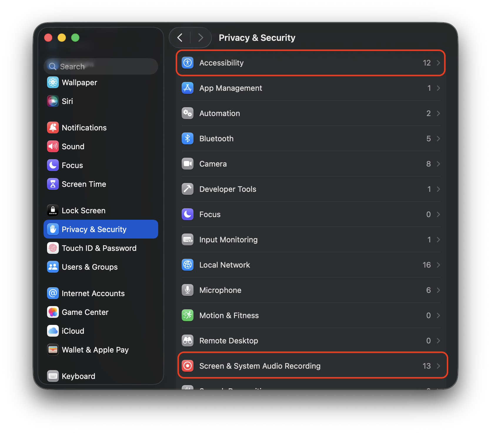

<p align="center"><a href="https://github.com/TencentCloudADP/youtu-tip/releases"></a></p>

<p align="center">
<a href="README_CN.md"><b>中文</b></a>
| <a href="https://www.youtu-tip.com"><b>Website</b></a>
| <a href="#what-is-tip"><b>Tip Overview</b></a>
| <a href="#how-to-use-tip"><b>Using Tip</b></a>
| <a href="#more-tip-tricks"><b>More Tip tricks</b></a>
| <a href="#youtu-agent"><b>Youtu-Agent</b></a>
| <a href="#youtu-llm-small-and-powerful"><b>Youtu-LLM</b></a>
| <a href="#performance-comparison"><b>Performance</b></a>
</p>

Tip is a proactive on-device AI assistant that intelligently understands your current work. As a more user-friendly extension of [Youtu-Agent](https://github.com/TencentCloudADP/Youtu-agent), Tip integrates desktop automation, agent invocation, and more. It is fully open source, supports offline on-device use, and keeps your privacy secure.

Tip is powered by a series of self-developed lightweight models:
- Youtu-LLM: A compact 1.96B model with powerful native agent capabilities.
  > [🤗 Model](https://huggingface.co/collections/tencent/youtu) | [📑 Technical Report](youtu-llm/assets/Youtu-LLM_Technical_Report.pdf) | [🚀 Quick Start Guide](youtu-llm/README.md)
- Youtu-VL: 4B on-device multimodal large model, comprehensive visual perception capability (soon to be open source)

You are also free to swap out the model for any alternative you prefer.

<video src="https://tristanli-1252178374.cos.ap-shanghai.myqcloud.com/tip-final.mp4?q-sign-algorithm=sha1&q-ak=AKIDyaSzUjDdvcJrWbarbrxd29viVh_rKVa0-dekHoAMPrm9MknVu6pRSJ71RAXDLTCh&q-sign-time=1767364915;1767368515&q-key-time=1767364915;1767368515&q-header-list=host&q-url-param-list=&q-signature=d6a8e20395fe2d588b2ca32f72e27e2d69b30ee7&x-cos-security-token=UQGzw0kKdbVEKWyDdqHnQox4tPpfpUPa053d0cc2759a2df943f2176168759b40N2fgkR-epkqgFWDejf1QrRZr1nIqkK0CcCHwU6LDf0a8DZS5NKtFvU57E8Mx-KKPKuWU6bmBM7NSwmgA--T_5E-OVgxCoRzGoS0iL5Sw20CZN2Ag4yzSUJgCoHA4BsSkbfEIerOW8fqO61LeteTu1TB11onLZsx4edkjCNC-06AnsjoWHSldV8aWpZnn-bwazNoN1CzH8Wp2PP2lDCBcCzF7-zD2ePjxDH3a66FMKxVx-5c1tR9wYTZQSuyFdFxoH0ii-a2Wwwx5o8JINIeMHg" 
poster="https://tristanli-1252178374.cos.ap-shanghai.myqcloud.com/tip_video_cover.jpg?q-sign-algorithm=sha1&q-ak=AKIDBSYucT1YSri_avLuGhkouZmjNIkx82ZmwivvlWRKRbtyRiQJnWbZgEdmyAnLL_cP&q-sign-time=1767365171;1767368771&q-key-time=1767365171;1767368771&q-header-list=host&q-url-param-list=ci-process&q-signature=d6338d6ed71ea0bc34c1aec7919ab4f8accc22d5&x-cos-security-token=UQGzw0kKdbVEKWyDdqHnQox4tPpfpUPa01f73b6040939a36a4276042208ebbf3N2fgkR-epkqgFWDejf1QrUqMVR1CWXeg4ZnpHOXNiSU-rUzikyGtgelY6gbqPdtEd7C9QiWNzW47gzLv3I1bjIK7qa42yKg8NMP_NHblf3MrcKv3TQzUXhwePE7IxCYQW-uF6zt-7myE-TyZot85e5z2_adFXuOcg60_cKYZiUM_MbthIHSsGALb--iahyyfaPNptVM372v-L32ngyo5QMFerrT23gxSkokUV45cciaSJkE98IV_sqgYBN3bTYEw60DbG2pZhZKDeMPLVwpntA&ci-process=originImage" 
controls muted preload="metadata" 
width="100%"></video>

---

## What is Tip

### Tip’s core traits

Tip focuses on “better interaction, safer privacy, broader capability”:

- **One hotkey, as the AI super entry**: With minimal interaction, you get the model’s power. Press the hotkey and select text or an image—Tip prepares the context for you. We are building a smarter Spotlight-style entry for a smoother AI experience.
- **On-device models for full privacy**: We support fully offline calls to local model services. All data and processing can run against your own on-device models. The Youtu-LLM series provides strong performance and agent ability for secure local work.
- **Read files, browse pages—no problem**: GUI Agent and Youtu Agent capabilities let Tip simulate mouse/keyboard actions for desktop control, connect to agents/MCP servers/tools for complex tasks, and run a multifunction agent locally.

### Why Tip was built

- **Data and privacy safety**: Many LLM agent apps default to processing data in the cloud. For privacy-sensitive scenarios like social platforms, users may not want screen content sent to cloud models and instead prefer private on-device solutions.
- **The last mile of interaction**: LLM apps usually start with a chat box and require typing. We want a smarter way to complete context: no manual typing, copy/paste, or image uploads—Tip understands what is on screen, completes context, infers intent, and suggests actions to reduce typing and close the interaction gap.
- **On-device agent environment**: Most agents live in the cloud, making it hard to run local tasks like “understand and organize local files” or “check chats on a social platform.” We aim to provide a mature framework and environment so users can run a more capable agent locally.


## How to use Tip

### Installer

We provide a download link: [Download link](github release)  
> Tip currently supports MacOS devices with Apple Silicon (M-series). More device types are being adapted and packaged quickly.

After downloading, grant the required permissions:
- On first launch, enable screen recording and accessibility permissions so shortcuts and screenshots work correctly.  
  > If Tip is not listed, click the + button, locate Tip, and add it. Permission scope: accessibility is used only to read current selection and simulate keyboard/mouse; screen and audio capture are used only for region screenshots.
- Press `ctrl + shift` to activate Tip and start using it.

<p align="center"></p>


### Quick start

Tip comes with Tip Cloud free credits by default, deployed on our platform endpoint. In “Settings - Models” you can add more models, including on-device offline models (Ollama) or OpenAI SDK-compatible endpoints (local or remote).

Three quick ways to invoke Tip:
- Press `ctrl + shift` to open the chat window and talk directly.
- Select some text, then press `ctrl + shift`; Tip will pick up the selection and continue the dialog with that context.
- Hold `ctrl + shift` to enter screenshot mode: while holding, drag to select a region; release to let Tip read the selected image area and continue the conversation.


## More Tip tricks

### GUI skills

We provide Claude-style “skills”: you can teach the model how to operate the computer and let it remember those actions for future use. For example, teach “find the cheapest flights”: open the site, click “sale flights,” then sort by price.

Add more skills under “Settings - GUI Agent” to help Tip operate the desktop more effectively.


### Youtu Agent

Tip integrates [Youtu Agent](https://github.com/TencentCloudADP/Youtu-agent) to give the model more abilities. In “Settings - Youtu Agent,” switch to a config file. Two demo configs are available: “File manager” (bash/file management) and “File manager plus” (adds some format-parsing ability).

When selecting a file, use “Right click - Open with - Tip” so Tip gets the file path. Click “Agent Execute” to have Tip interpret the file contents.


### Connect on-device models

Our on-device model service supports two entry points:

#### Use the Ollama endpoint

Install and start Ollama, pull, and run a local model:

1. Download: visit ollama.com and click “Download macOS.”
2. Unzip the file, drag `Ollama.app` into Applications, run it, and finish setup (Next -> Install).
3. Open Terminal and run: `ollama serve`
4. Open another Terminal window and run: `ollama pull <model-name>`

Once running, connect Tip:

1. In “Settings - Models,” click Add.
2. In “Channel,” choose “ollama” and enter the model name.
3. Save, then connect it in “Settings - General.”

Our Youtu-LLM on-device models are applying for official Ollama endpoints and will be downloadable soon.


#### Use the OpenAI endpoint

We also support the standard OpenAI SDK entry. You can use any online provider or local services like `llama-server`.

1. In “Settings - Models,” click Add.
2. In “Channel,” choose “OpenAI SDK” and fill in `base_url`, `api_key`, `model`, etc.
3. Save, then connect it in “Settings - General.”


## Local development

The full source code and architecture are open. You can develop and package locally to customize any feature. See: [README](youtu-tip/README.md)


---


## Youtu-LLM: Small and powerful

We proudly introduce Youtu-LLM: a compact yet powerful LLM with 1.96B parameters, 128K context, and native agent ability. In general evaluations, Youtu-LLM significantly outperforms peers of similar size in commonsense, STEM, coding, and long-context tasks. In agent benchmarks, Youtu-LLM surpasses larger models and completes multiple end-to-end agent tasks.


### Highlights

Youtu-LLM’s main contributions:
- **Designed for STEM capability**: vocabulary, data mix, and multi-stage curriculum center on STEM and agent performance.
- **Native agent ability**: trained with 128K context plus Agentic Mid-training to enable more rounds of interaction on-device.
- **SOTA performance**: based on a dense MLA architecture, Youtu-LLM achieves SOTA results on lightweight LLMs, outperforming traditional dense GQA/MHA. MLA also makes integration into DSV3-oriented ecosystems straightforward.


## Performance comparison

We provide Base and Instruct models with strong results across benchmarks, plus evaluation code to reproduce scores. See [README](youtu-llm/README.md) for details.

### Base Model
#### General Benchmarks
| Type | Benchmark (Metric) | # Shots | Qwen3-1.7B-Base | SmoLM3-3B-Base | Gemma3-4B-Base | Qwen3-4B-Base | Llama3.1-8B | Youtu-LLM-2B-Base |
| :--- | :--- | :---: | :---: | :---: | :---: | :---: | :---: | :---: |
| Commonsense  | MMLU-Pro (EM) | 5 | 34.9% | 35.3% | 29.4% | <u>46.1%</u> | 36.2% | **48.4%** |
|              | MLQA-Zh (EM) | 3 | 38.1% | 38.0% | 40.3% | **47.2%** | 43.0% | <u>43.5%</u> |
|              | MMLU-ProX-Zh (EM) | 5 | 32.5% | 26.7% | 24.2% | **45.2%** | 25.4% | <u>40.7%</u> |
| STEM         | GSM8K (EM) | 8 | 68.2% | 67.3% | 38.5% | **80.8%** | 47.8% | <u>77.6%</u> |
|              | MGSM-Zh (EM) | 8 | 57.1% | 40.7% | 33.0% | **69.7%** | 35.9% | <u>68.9%</u> |
|              | MATH (EM) | 4 | 28.1% | 40.8% | 24.4% | **44.8%** | 21.5% | <u>44.4%</u> |
|              | BBH (EM) | 3 | 53.0% | 59.8% | 51.6% | **70.8%** | <u>62.9%</u> | 59.8% |
|              | GPQA-MC (Acc. Norm) | 5 | 30.4% | 26.6% | 28.6% | **37.8%** | 30.1% | <u>33.3%</u> |
|              | HLE-MC (Acc. Norm) | 3 | 10.7% | 3.1% | 8.0% | <u>15.0%</u> | 11.5% | **17.4%** |
| Coding       | MBPP (Pass@1) | 3 | 55.6% | 51.0% | 45.8% | **67.5%** | 49.4% | <u>66.6%</u> |
|              | MBPP+ (Pass@1) | 3 | 71.0% | 66.1% | 61.9% | <u>80.8%</u> | 62.7% | **81.8%** |
|              | HumanEval (Pass@1) | 0 | 49.9% | 34.8% | 36.6% | <u>57.6%</u> | 36.0% | **64.6%** |
|              | HumanEval+ (Pass@1) | 0 | 41.3% | 28.1% | 28.1% | <u>49.9%</u> | 28.1% | **57.3%** |
|              | LiveCodeBench v6 (Pass@1) | 3 | 5.1% | 2.9% | 2.9% | <u>6.9%</u> | 3.4% | **9.7%** |
|              | CRUXEval (Pass@1) | 1 | 40.6% | 42.1% | 39.7% | <u>54.8%</u> | 42.3% | **55.9%** |
|              | RepoBench (EM) | 3 | 21.0% | 21.8% | 23.0% | **25.3%** | <u>25.2%</u> | 22.7% |
| Long Context | LongBench v2 (Acc.) | 3 | <u>28.0%</u> | **28.8%** | 26.6% | 25.8% | 27.8% | 27.2% |
|              | NIAH (Acc.) | / | 79.8% | 75.0% | <u>99.5%</u> | 83.0% | **99.8%** | 98.8% |

#### Agentic Benchmarks
We takes [APTBench](https://github.com/TencentYoutuResearch/APTBench/) for evaluating the agentic capabilities of base model.

| Category | Qwen3-1.7B-Base | SmoLM3-3B-Base | Gemma3-4B-Base | Qwen3-4B-Base | Llama3.1-8B | Youtu-LLM-2B-Base |
| :--- | :---: | :---: | :---: | :---: | :---: | :---: |
| Code | 25.1% | 24.3% | 32.8% | **41.9%** | 23.6% | <u>37.9%</u> |
| Deep Research | 28.5% | 27.2% | 36.4% | **40.5%** | 30.0% | <u>38.6%</u> |
| Math | 59.9% | 60.7% | 59.8% | **70.5%** | 60.1% | <u>68.0%</u> |
| Tool | 56.7% | 59.1% | 61.7% | **65.8%** | 64.1% | <u>64.2%</u> |

### Instruct Model
#### General Benchmarks
| Benchmark | DeepSeek-R1-Distill-Qwen-1.5B | Qwen3-1.7B | SmolLM3-3B | Qwen3-4B | DeepSeek-R1-Distill-Llama-8B | Youtu-LLM-2B |
| :--- | :---: | :---: | :---: | :---: | :---: | :---: |
| **Commonsense Knowledge Reasoning** | | | | | | |
| MMLU-Redux | 53.0% | 74.1% | 75.6% | **83.8%** | <u>78.1%</u> | 75.8% |
| MMLU-Pro | 36.5% | 54.9% | 53.0% | **69.1%** | 57.5% | <u>61.6%</u> |
| **Instruction Following & Text Reasoning** | | | | | | |
| IFEval | 29.4% | 70.4% | 60.4% | **83.6%** | 34.6% | <u>81.2%</u> |
| DROP | 41.3% | 72.5% | 72.0% | <u>82.9%<u> | 73.1% | **86.7%** |
| MUSR | 43.8% | 56.6% | 54.1% | **60.5%** | <u>59.7%</u> | 57.4% |
| **STEM** | | | | | | |
| MATH-500 | 84.8% | 89.8% | 91.8% | **95.0%** | 90.8% | <u>93.7%</u> |
| AIME 24 | 30.2% | 44.2% | 46.7% | **73.3%** | 52.5% | <u>65.4%</u> |
| AIME 25 | 23.1% | 37.1% | 34.2% | **64.2%** | 34.4% | <u>49.8%</u> |
| GPQA-Diamond | 33.6% | 36.9% | 43.8% | **55.2%** | 45.5% | <u>48.0%</u> |
| BBH | 31.0% | 69.1% | 76.3% | **87.8%** | <u>77.8%</u> | 77.5% |
| **Coding** | | | | | | |
| HumanEval | 64.0% | 84.8% | 79.9% | <u>95.4%<u> | 88.1% | **95.9%** |
| HumanEval+ | 59.5% | 76.2% | 74.7% | <u>87.8%</u> | 82.5% | **89.0%** |
| MBPP | 51.5% | 80.5% | 66.7% | **92.3%** | 73.9% | <u>85.0%</u> |
| MBPP+ | 44.2% | 67.7% | 56.7% | **77.6%** | 61.0% | <u>71.7%</u> |
| LiveCodeBench v6 | 19.8% | 30.7% | 30.8% | **48.5%** | 36.8% | <u>43.7%</u> |

#### Agentic Benchmarks
| Benchmark | Qwen3-1.7B | SmolLM3-3B | Qwen3-4B | Youtu-LLM-2B |
| :--- | :---: | :---: | :---: | :---: |
| **Deep Research** | | | | |
| GAIA | 11.4% | 11.7% | <u>25.5%</u> | **33.9%** |
| xbench | 11.7% | 13.9% | <u>18.4%</u> | **19.5%** |
| **Code** | | | | |
| SWE-Bench-Verified | 0.6% | <u>7.2%</u> | 5.7% | **17.7%** |
| EnConda-Bench | 10.8% | 3.5% | <u>16.1%</u> | **21.5%** |
| **Tool** | | | | |
| BFCL V3 | 55.5% | 31.5% | **61.7%** | <u>58.0%</u> |
| τ²-Bench | 2.6% | 9.7% | <u>10.9%</u> | **15.0%** |


## Using Youtu-LLM

Usage:

```python
from transformers import AutoTokenizer, AutoModelForCausalLM

tokenizer = AutoTokenizer.from_pretrained("tencent/Youtu-LLM-2B", trust_remote_code=True)
model = AutoModelForCausalLM.from_pretrained(
    "tencent/Youtu-LLM-2B",
    device_map="auto",
    trust_remote_code=True
)
```

We provide a quick start covering “inference with transformers,” “configure thinking mode,” “tune decoding params,” and “deploy with vLLM and tool use.” See: [README](youtu-llm/README.md)


## License

Youtu-Tip and Youtu-LLM are open-sourced under [LICENSE](./LICENSE).

## 📚 Citation

If you find this work useful, please consider citing:

```bibtex
@article{youtu-agent,
  title={Youtu-Agent: Scaling Agent Productivity with Automated Generation and Hybrid Policy Optimization}, 
  author={Tencent Youtu Lab},
  year={2025},
  eprint={2512.24615},
  archivePrefix={arXiv},
  primaryClass={cs.AI},
  url={https://arxiv.org/abs/2512.24615}, 
}

@article{youtu-llm,
  title={Youtu-LLM: Unlocking the Native Agentic Potential for Lightweight Large Language Models},
  author={Tencent Youtu Lab},
  year={2025},
  eprint={2512.24618},
  archivePrefix={arXiv},
  primaryClass={cs.CL},
  url={https://arxiv.org/abs/2512.24618}, 
}
```
